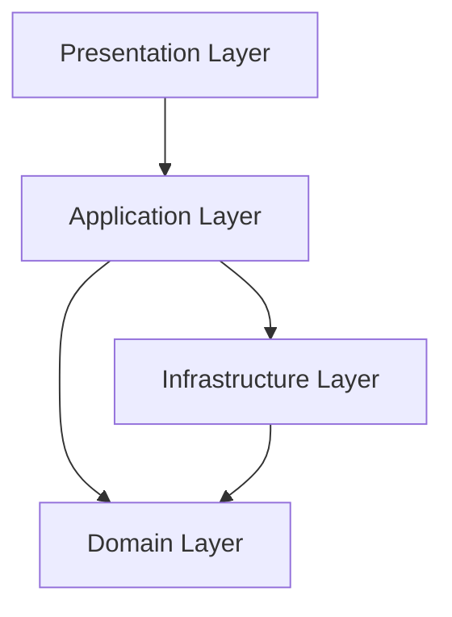

# Clean Architecture Layers

Four layers. Dependencies point **inward**. Domain has zero NestJS / Prisma / HTTP / Redis imports.

---

## Presentation

**May contain**

- Controllers for `/api/v1` and `/admin/v1`
- Guards, decorators (`@CurrentTenant()`, auth)
- Request / response DTOs + `class-validator`
- Swagger / OpenAPI
- Exception filters, interceptors (incl. Idempotency)
- Mapping HTTP ↔ Commands/Queries

**Must NOT contain**

- Business rules or domain invariants
- Prisma / SQL
- Direct provider HTTP (Meta, SMS, …)
- Redis / encryption / storage clients
- Outbox or queue publishing logic

Controllers dispatch Commands or Queries only.

---

## Application (CQRS-ready)

Every use case is **either a Command or a Query** — never both. **No Event Sourcing.**

**May contain**

- Commands + Command Handlers (writes)
- Queries + Query Handlers (reads)
- Communication SDK (messaging facade)
- Orchestration, authorization checks, transactions
- Enrollment of domain events into Outbox (via repos/UoW)
- Capability checks via `provider.capabilities()`

**Must NOT contain**

- Meta / provider-specific payload types
- Raw Redis clients (`ioredis`)
- SQL / Prisma usage
- `Date.now()` / `new Date()` — inject `Clock`
- `process.env` — inject `ConfigurationService`
- Raw UUID generation — inject `IdentifierService`
- Business invariants that belong in Domain

| Side | Examples |
|------|----------|
| **Commands** | SendMessage, ConnectAccount, GenerateApiKey, CreateContact |
| **Queries** | GetMessage, ListConversations, DashboardStats, GetMe |

- Command handlers → Write Repositories + Outbox (same transaction)
- Query handlers → Read Repositories / views / cache — never reimplement write policies

---

## Domain

**May contain**

- Entities, aggregates
- Value Objects (`PhoneNumber`, `EmailAddress`, `ApiKey`, `ProviderMessageId`, …)
- Domain services
- Domain event **definitions** (types/names/payloads)
- Repository **interfaces**
- `ChannelProvider` + `ProviderCapabilities` interfaces
- Plugin / AI interfaces (stubs)
- Typed Domain Errors (`CapabilityNotSupported`, `IdempotencyKeyConflict`, …)

**Must NOT contain**

- NestJS decorators / modules
- Prisma, Axios, BullMQ, Redis
- Env access or framework config
- Knowledge of Meta Graph shapes, phone number IDs, Graph versions

---

## Infrastructure

**May contain**

- Prisma write/read repository implementations
- Outbox store + Outbox worker
- Idempotency store
- `WhatsAppChannelProvider` (only place Meta types live)
- `ObjectStorageProvider` adapters
- `CacheService`, `SecretService`, `ConfigurationService`
- `Clock` / `IdentifierService` adapters
- BullMQ workers, Observability sinks

**Must NOT contain**

- End-to-end business workflows owned by Application handlers
- Feature gates by provider **name** (capabilities live in Domain interfaces; business checks happen in Application)

---

## Dependency rule

| From → To | Allowed? |
|-----------|----------|
| Presentation → Application | Yes |
| Application → Domain | Yes |
| Application → Infrastructure (via interfaces) | Yes (wiring in Nest modules) |
| Infrastructure → Domain | Yes (implements interfaces) |
| Domain → anything outer | **No** |
| Presentation → Infrastructure | **No** (except Nest DI setup at composition root) |

See: [ADR 0002](../adr/0002-clean-architecture.md), [ADR 0006](../adr/0006-cqrs-ready-no-event-sourcing.md).
