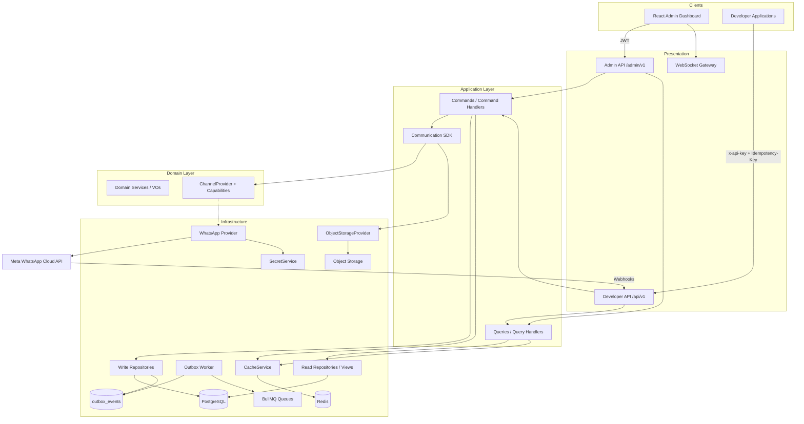

# System Context

## Actors

| Actor | Interaction |
|-------|-------------|
| Developer applications | REST `/api/v1` with `x-api-key` |
| React Admin dashboard | REST `/admin/v1` with JWT; WebSocket |
| Channel providers (Meta, …) | Inbound webhooks only |

## Context diagram



## Canonical call chain (outbound send)

```
Client
  → Presentation (validate DTO, Idempotency-Key, auth)
  → Command Handler (authorize, capability check, persist)
  → Communication SDK
  → ChannelProvider (interface)
  → WhatsAppChannelProvider (infrastructure)
  → Meta WhatsApp Cloud API
```

REST returns after the message is persisted as `QUEUED` and the job is enqueued. The worker invokes the SDK/provider asynchronously (queue-first).

## Inbound webhook chain

```
Meta → GET/POST /api/v1/webhooks/whatsapp/:accountId
  → ChannelProvider.verify / validateSignature / parseWebhook
  → persist webhook_events + enqueue process
  → Command Handler (idempotent on providerMessageId)
  → write repositories + Outbox(domain events)
```

## Outbox pattern

Domain events are **not** published in-process after a write.

1. Command Handler mutates state via Write Repository
2. Same DB transaction inserts row(s) into `outbox_events`
3. Commit
4. Outbox Worker polls/dequeues PENDING events and publishes to listeners / queues
5. Side effects (Realtime, Audit, Analytics, outbound webhooks) run after publish

Crash between write and publish is recoverable; worker retries until published.

## Core invariants

1. Developers never call Meta (or any provider) directly
2. Application/Domain never import WhatsApp/Meta types or Graph API specifics
3. Only `WhatsAppChannelProvider` knows Meta payloads, Graph version, phone number IDs
4. Credentials → `SecretService` only; Redis → `CacheService` only; env → `ConfigurationService` only
5. Domain events go through **Outbox in the same transaction** as business writes
6. Developer writes that clients may retry require **`Idempotency-Key`**
7. Commands mutate; Queries read — **no Event Sourcing**
8. Feature gates use **`ProviderCapabilities`**, never `if (channel === 'whatsapp')`
9. Every request propagates `requestId`, `correlationId`, and `organizationId` through logs, queues, outbox, and provider calls
10. Tenant rows are always scoped by `organizationId` (Super Admin cross-tenant access is explicit and audited)

## Tenancy snapshot

| Org type | Role |
|----------|------|
| `SYSTEM` | Platform operator; Super Admins |
| `TENANT` | Customer org |

`TenantContext`: `{ organizationId, userId?, apiKeyId?, role, permissions[], requestId, correlationId, ip }`

See also: [implementation-principles.md](./implementation-principles.md), [ADR 0007 Outbox](../adr/0007-outbox-pattern.md).
